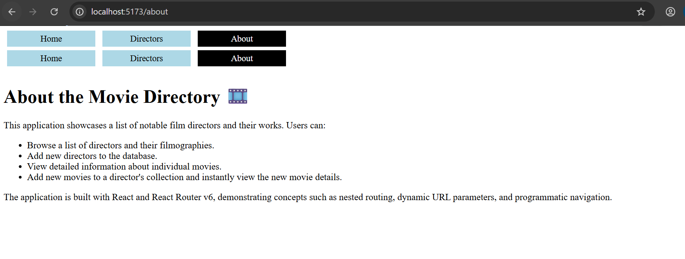

# 🎬 Movie Directory App

A React application that allows users to browse directors and movies using nested routing with React Router v6.

---

## 📌 Project Overview

The Movie Directory App demonstrates client-side routing, nested routes, dynamic URL parameters, and programmatic navigation in React.

Users can:

* View a list of directors
* Add new directors
* View director details
* Browse movies by director
* Add movies to a director
* View individual movie details
* Navigate seamlessly using React Router v6

---

## 🖼️ Application Screenshot

> Add your screenshot image inside your project folder (recommended: `src/assets/` or `public/`)


### Preview



---

## 🚀 Features

* React Router v6 routing
* Nested routes with `<Outlet />`
* Dynamic URL parameters using `useParams`
* Shared state using `useOutletContext`
* Programmatic navigation using `useNavigate`
* Responsive navigation links
* Error handling for invalid routes
* Fully tested with Vitest

---

## 🛠️ Technologies Used

* React
* React Router DOM v6
* JavaScript (ES6+)
* Vite
* Vitest
* CSS

---

## 📂 Project Structure

```txt
src/
├── components/
│   ├── NavBar.jsx
│   └── NavBar.css
│
├── pages/
│   ├── About.jsx
│   ├── DirectorCard.jsx
│   ├── DirectorContainer.jsx
│   ├── DirectorForm.jsx
│   ├── DirectorList.jsx
│   ├── ErrorPage.jsx
│   ├── Home.jsx
│   ├── MovieCard.jsx
│   └── MovieForm.jsx
│
├── App.jsx
├── main.jsx
└── index.css
```

---

## 🧭 Application Routes

| Route                            | Description        |
| -------------------------------- | ------------------ |
| `/`                              | Home page          |
| `/about`                         | About page         |
| `/directors`                     | List of directors  |
| `/directors/new`                 | Add a new director |
| `/directors/:id`                 | Director details   |
| `/directors/:id/movies/new`      | Add a movie        |
| `/directors/:id/movies/:movieId` | Movie details      |

---

## ⚙️ Installation

Clone the repository:

```bash
git clone <your-repository-url>
```

Navigate into the project folder:

```bash
cd movie-directory-app
```

Install dependencies:

```bash
npm install
```

Install React Router v6:

```bash
npm install react-router-dom@6
```

---

## ▶️ Running the Application

Start the JSON server:

```bash
npm run server
```

Start the development server:

```bash
npm run dev
```

---

## 🧪 Running Tests

Run Vitest:

```bash
npm run test
```

---

## ✅ Test Results

* 9 tests passing
* Nested routes verified
* Navigation verified
* Dynamic routes verified
* Error handling verified

---

## 📖 Concepts Demonstrated

* React Router v6
* Nested Routing
* Dynamic Routing
* Programmatic Navigation
* State Management
* Outlet Context
* Component Composition

---

## 👨‍💻 Author

Created as part of a React Router v6 routing lab project.

---

